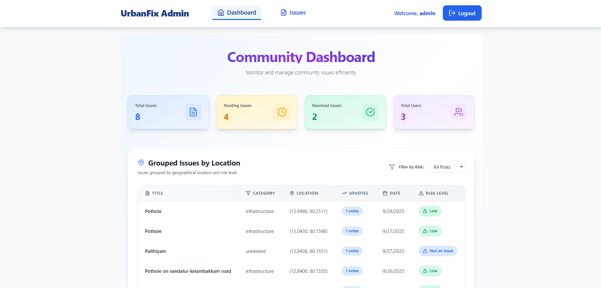
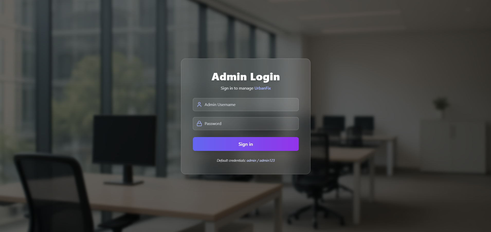
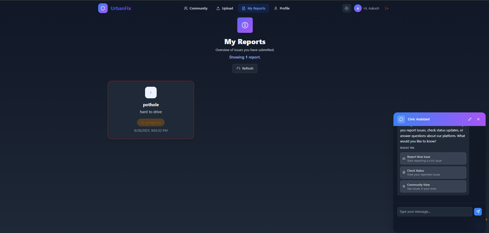
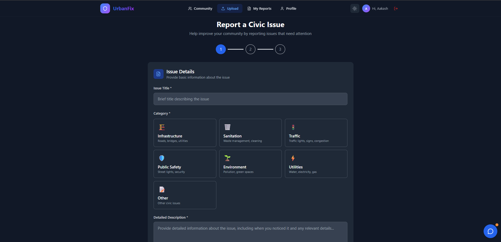

# 🚀 UrbanFix - Smart Urban Issue Reporting & Management

UrbanFix is a modern, AI-powered full-stack platform for citizens and administrators to report, track, and resolve urban infrastructure issues. Built for hackathons, city challenges, and real-world deployment.

---
## Screenshots

### Admin Portal
<p align="center">
   
   <br><em>Admin Dashboard: Grouped issues, risk levels, and stats</em>
</p>
<p align="center">
   
   <br><em>Admin Login: Secure authentication for administrators</em>
</p>

### User Portal
<p align="center">
   
   <br><em>My Reports & Chatbot: Track submitted issues and get real-time help</em>
</p>
<p align="center">
   
   <br><em>Report a Civic Issue: Upload and categorize issues with a guided form</em>
</p>

---
## 🌟 Features

### For Citizens
- Report issues (potholes, streetlights, sanitation, etc.) with images, location, and description
- Upvote issues to signal urgency (grouped by location)
- View and manage your reports
- Real-time updates, notifications, and dark mode

### For Administrators
- Secure admin portal with login
- Dashboard: grouped issues, unified status, upvotes, and risk classification
- Change issue status, add notes, filter by risk and status
- AI-powered risk analysis (Gemini API)
- View images, user details, and GPS

### Technical Highlights
- React (Vite) frontend, Node.js/Express backend, MongoDB database
- Multer for image uploads
- Tailwind CSS for beautiful UI
- Leaflet for interactive maps
- Gemini API for risk and summary analysis

---
## ⚡ Quick Start

### Prerequisites
- Node.js v16+
- MongoDB (local or Atlas)
- Git

### Setup
1. Clone the repo and run `setup.bat` (Windows)
2. Edit `backend/.env` with your MongoDB URI and Gemini API key
3. Start backend (`start-backend.bat`), frontend (`start-frontend.bat`), and admin (`cd admin && npm run dev`)

### Access
- User frontend: http://localhost:5173
- Admin portal: http://localhost:3001 (login: admin/admin123)
- Backend API: http://localhost:5000

---
## 🗄️ Database Schema

**Issue:**
```js
{
   _id, title, description, image, location: {lat, lng}, userId, userEmail,
   status, upvotes, priority, category, adminNotes, createdAt, updatedAt
}

---
## 🧪 Testing & Troubleshooting

### Manual Testing
- Test backend API with curl or Postman
- Test frontend and admin UI in browser

### Key Features to Test
- Issue submission, image upload, location
- Grouping and unified status in admin dashboard
- Risk classification and filtering
- Responsive design and dark mode

### Troubleshooting
- Check MongoDB connection and credentials
- Ensure correct ports in .env and vite.config.js
- Image upload: check file size and uploads/ folder
- CORS: verify URLs in .env

---
## 🔧 Configuration

**Backend .env:**
```
MONGODB_URI=your_mongodb_uri
PORT=5000
GEMINI_API_KEY=your_gemini_api_key
FRONTEND_URL=http://localhost:5173
ADMIN_URL=http://localhost:3001
ADMIN_USERNAME=admin
ADMIN_PASSWORD=admin123
JWT_SECRET=your-secret-key
MAX_FILE_SIZE=5242880
```

---
## 🤝 Contributing

1. Fork and branch
2. Commit and push changes
3. Open a pull request

---
## 📄 License & Credits

This project is part of a hackathon submission for urban infrastructure management.

**Acknowledgments:**
- MongoDB, React, Express.js, Leaflet, Tailwind CSS

---

**Happy coding! 🎉**


# 🚀 UrbanFix - Smart Urban Issue Reporting & Management

<p align="center">
   
</p>

**UrbanFix** is a modern, AI-powered full-stack platform for citizens and administrators to report, track, and resolve urban infrastructure issues. Built for hackathons, city challenges, and real-world deployment.

---

## 🌈 Project Screenshots

### 🛡️ Admin Portal

<p align="center">
   
   <br><em><b>Admin Dashboard:</b> Community Dashboard with grouped issues, risk levels, and stats</em>
</p>

<p align="center">
   
   <br><em><b>Admin Login:</b> Secure authentication for administrators</em>
</p>

---

### 👤 User Portal (Frontend)

<p align="center">
   
   <br><em><b>My Reports & Chatbot:</b> Track your submitted issues and get real-time help from the Civic Assistant chatbot.</em>
</p>

<p align="center">
   
   <br><em><b>Report a Civic Issue:</b> Upload and categorize issues (infrastructure, sanitation, traffic, etc.) with a guided, user-friendly form.</em>
</p>

---


## �🌟 Features

### 👥 For Citizens
- Report issues (potholes, streetlights, sanitation, etc.) with images, location, and description
- Upvote issues to signal urgency (grouped by location)
- View and manage your reports
- Real-time updates, notifications, and dark mode

### 🛠️ For Administrators
- Secure admin portal with login
- Dashboard: grouped issues, unified status, upvotes, and risk classification
- Change issue status, add notes, filter by risk and status
- AI-powered risk analysis (Gemini API)
- View images, user details, and GPS

### 💡 Technical Highlights
- React (Vite) frontend, Node.js/Express backend, MongoDB database
- Firebase authentication
- Multer for image uploads
- Tailwind CSS for beautiful UI
- Leaflet for interactive maps
- Gemini API for risk and summary analysis

<p align="center">
   
   <br><em><b>Admin Dashboard:</b> Community Dashboard with grouped issues, risk levels, and stats</em>
</p>

<p align="center">
   
   <br><em><b>Admin Login:</b> Secure authentication for administrators</em>
</p>
- **UI/UX:** Professional, accessible design, dark/light mode, mobile responsiveness, interactive dashboards
- **Security:** JWT authentication, secure admin portal, real-time monitoring

---

## 🏗️ Architecture & Project Structure

```
UrbanFix/
├── frontend/    # React user app
├── admin/       # React admin portal
├── backend/     # Node.js/Express API

<p align="center">
   
   <br><em><b>My Reports & Chatbot:</b> Track your submitted issues and get real-time help from the Civic Assistant chatbot.</em>
</p>

<p align="center">
   
   <br><em><b>Report a Civic Issue:</b> Upload and categorize issues (infrastructure, sanitation, traffic, etc.) with a guided, user-friendly form.</em>
</p>
## ⚡ Quick Start

### Prerequisites
- Node.js v16+
1. Clone the repo and run `setup.bat` (Windows)
2. Edit `backend/.env` with your MongoDB URI and Gemini API key
- Backend API: http://localhost:5000

- Dashboard with grouped issues, unified status, upvotes, and risk level
- AI-powered risk classification (Gemini API)

---
- `GET /api/issues/user/:userId` - Get user's issues
- `PUT /api/issues/:id/upvote` - Toggle upvote
- `DELETE /api/issues/:id` - Delete issue

**Admin:**
- `POST /api/admin/login` - Admin login
- `GET /api/admin/stats` - Dashboard stats
- `GET /api/admin/issues` - Get all issues
- `PUT /api/admin/issues/:id` - Update status

**Images:**
- Served from `/uploads/{filename}`

---

## 🗄️ Database Schema

**Issue:**
```js
{
   _id, title, description, image, location: {lat, lng}, userId, userEmail,
   status, upvotes, priority, category, adminNotes, createdAt, updatedAt
}


---

## 🧪 Testing & Troubleshooting

### Manual Testing
- Test backend API with curl or Postman
- Test frontend and admin UI in browser

### Key Features to Test
- Issue submission, image upload, location
- Grouping and unified status in admin dashboard
- Risk classification and filtering
- Responsive design and dark mode

### Troubleshooting
- Check MongoDB connection and credentials
- Ensure correct ports in .env and vite.config.js
- Image upload: check file size and uploads/ folder
- CORS: verify URLs in .env

---

## 🔧 Configuration

**Backend .env:**
```
MONGODB_URI=your_mongodb_uri
PORT=5000
GEMINI_API_KEY=your_gemini_api_key
FRONTEND_URL=http://localhost:5173
ADMIN_URL=http://localhost:3001
ADMIN_USERNAME=admin
ADMIN_PASSWORD=admin123
JWT_SECRET=your-secret-key
MAX_FILE_SIZE=5242880
```

---

## 🤝 Contributing

1. Fork and branch
2. Commit and push changes
3. Open a pull request

---

## 📄 License & Credits

This project is part of a hackathon submission for urban infrastructure management.

**Acknowledgments:**
- MongoDB, React, Express.js, Leaflet, Tailwind CSS

---

**Happy coding! 🎉**

## Tech Stack

**Frontend:** React, Vite, Tailwind CSS, Axios, Leaflet, Firebase
**Backend:** Node.js, Express, MongoDB, Mongoose, Multer, dotenv

## Quick Start

### Prerequisites
- Node.js v16+
- MongoDB (local or Atlas)
- Git

### Setup
1. Clone the repo and run `setup.bat` (Windows)
2. Edit `backend/.env` with your MongoDB URI and Gemini API key
3. Start backend (`start-backend.bat`), frontend (`start-frontend.bat`), and admin (`cd admin && npm run dev`)

### Access
- User frontend: http://localhost:5173
- Admin portal: http://localhost:3001 (login: admin/admin123)
- Backend API: http://localhost:5000

## Admin Portal

The admin portal provides:
- Secure login
- Dashboard with grouped issues, unified status, upvotes, and risk level
- Issue management: admins can change the status of any issue (pending, in-progress, resolved, rejected), view details, and filter by risk/status
- Strict risk classification (Gemini API)

## API Endpoints

**Issues:**
- GET `/api/issues` - Get all issues (grouped by location/category)
- GET `/api/issues/user/:userId` - Get user's issues
- POST `/api/issues` - Create new issue
- PUT `/api/issues/:id/upvote` - Toggle upvote
- DELETE `/api/issues/:id` - Delete issue

**Admin:**
- POST `/api/admin/login` - Admin login
- GET `/api/admin/stats` - Dashboard stats
- GET `/api/admin/issues` - Get all issues
- PUT `/api/admin/issues/:id` - Update status

**Images:**
- Served from `/uploads/{filename}`

## Database Schema

**Issue:**
```js
{
   _id, title, description, image, location: {lat, lng}, userId, userEmail,
   status, upvotes, priority, category, adminNotes, createdAt, updatedAt
}
```

## Project Structure

See code folders for details on frontend, backend, and admin structure.

## Testing

**Manual:**
- Test backend API with curl or Postman
- Test frontend and admin UI in browser

**Key Features to Test:**
- Issue submission, image upload, location
- Grouping and unified status in admin dashboard
- Risk classification and filtering
- Responsive design and dark mode

## Configuration

**Backend .env:**
```
MONGODB_URI=your_mongodb_uri
PORT=5000
GEMINI_API_KEY=your_gemini_api_key
FRONTEND_URL=http://localhost:5173
ADMIN_URL=http://localhost:3001
ADMIN_USERNAME=admin
ADMIN_PASSWORD=admin123
JWT_SECRET=your-secret-key
MAX_FILE_SIZE=5242880
```

## Troubleshooting

- Check MongoDB connection and credentials
- Ensure correct ports in .env and vite.config.js
- Image upload: check file size and uploads/ folder
- CORS: verify URLs in .env

## Contributing

1. Fork and branch
2. Commit and push changes
3. Open a pull request

## License

Hackathon project for urban infrastructure management.

---

For questions or support, see troubleshooting or open an issue.

### Prerequisites

Make sure you have installed:
- [Node.js](https://nodejs.org/) (v16 or higher)
- [MongoDB](https://www.mongodb.com/try/download/community) (local installation) or MongoDB Atlas account
- Git

Manual Setup

1. **Backend Setup**
   ```bash
   cd backend
   npm install
   copy .env.example .env
   # Edit .env file with your MongoDB connection
   npm run dev
   ```

2. **Frontend Setup (in new terminal)**
   ```bash
   cd frontend
   npm install
   npm run dev
   ```

3. **Admin Portal Setup (in new terminal)**
   ```bash
   cd admin
   npm install
   npm run dev
   ```

### Access the Application

- **User Frontend**: http://localhost:5173 (Citizens report issues)
- **Admin Portal**: http://localhost:3001 (Administrator dashboard) 
  - Default login: `admin` / `admin123`
- **Backend API**: http://localhost:5000
- **API Test**: http://localhost:5000/api/test

## � Admin Portal

The admin portal is a completely separate React application that provides administrators with comprehensive tools to manage reported issues.

### Admin Features

- **Secure Login**: JWT-based authentication with default credentials `admin`/`admin123`
- **Dashboard Overview**: 
  - Total issues count
  - Pending issues count  
  - Resolved issues count
  - Total users count
  - Recent issues list
- **Issues Management**:
  - View all issues with uploaded images
  - Filter by status (All, Pending, In Progress, Resolved)
  - Update issue status via dropdown
  - View detailed issue information in modal popup
  - Access user contact details and GPS coordinates
- **Professional UI**: Clean, responsive design built with Tailwind CSS

### Admin Portal Setup

```bash
# Navigate to admin directory
cd admin

# Install dependencies
npm install

# Start development server
npm run dev

# Access admin portal
# Open http://localhost:3001
# Login with: admin / admin123
```

### Admin API Endpoints

| Method | Endpoint | Description |
|--------|----------|-------------|
| POST | `/api/admin/login` | Admin authentication |
| GET | `/api/admin/stats` | Dashboard statistics |
| GET | `/api/admin/issues` | Get all issues (with filtering) |
| PUT | `/api/admin/issues/:id` | Update issue status |

## �📡 API Documentation

### Issues Endpoints

| Method | Endpoint | Description | Body |
|--------|----------|-------------|------|
| GET | `/api/issues` | Get all issues | - |
| GET | `/api/issues/user/:userId` | Get user's issues | - |
| POST | `/api/issues` | Create new issue | FormData with title, description, userId, userEmail, location, image |
| PUT | `/api/issues/:id/upvote` | Toggle upvote | `{ userId }` |
| DELETE | `/api/issues/:id` | Delete issue | - |

### Admin Endpoints

| Method | Endpoint | Description | Body |
|--------|----------|-------------|------|
| GET | `/api/admin/issues` | Get all issues (admin) | - |
| GET | `/api/admin/stats` | Get statistics | - |
| PUT | `/api/admin/issues/:id` | Update issue status | `{ status, priority, adminNotes }` |
| DELETE | `/api/admin/issues/:id` | Delete issue (admin) | - |

### Image Upload

Images are served from: `http://localhost:5000/uploads/{filename}`

## 💾 Database Schema

### Issue Collection
```javascript
{
  _id: ObjectId,
  title: String (required, max 200 chars),
  description: String (required, max 1000 chars),
  image: String (filename),
  location: {
    lat: Number (required, -90 to 90),
    lng: Number (required, -180 to 180)
  },
  userId: String (required),
  userEmail: String (required, valid email),
  status: String (pending|in-progress|resolved|rejected),
  upvotes: [String], // Array of user IDs
  priority: String (low|medium|high|critical),
  category: String (infrastructure|sanitation|traffic|environment|public-safety|other),
  adminNotes: String,
  createdAt: Date,
  updatedAt: Date
}
```

## 📁 Project Structure

### Frontend Structure
```
frontend/src/
├── components/           # Reusable UI components
│   ├── IssueCard.jsx        # Issue display card
│   ├── IssueTable.jsx       # Admin table for issues
│   ├── UploadIssue.jsx      # Issue submission form
│   ├── MapView.jsx          # Map component
│   └── ...
├── pages/               # Route pages
│   ├── HomePage.jsx         # Landing page
│   ├── AdminDashboard.jsx   # Admin panel
│   ├── Upload.jsx           # Issue upload page
│   └── ...
├── api/                 # API integration
│   ├── issues.js            # Issue-related API calls
│   ├── admin.js             # Admin API calls
│   └── auth.js              # Authentication API
├── context/             # React contexts
│   ├── AuthContext.jsx      # Authentication state
│   └── DarkModeContext.jsx  # Theme state
└── ...
```

### Backend Structure
```
backend/src/
├── controllers/         # Business logic
│   ├── issueController.js   # Issue CRUD operations
│   └── adminController.js   # Admin operations
├── models/             # Database schemas
│   └── Issue.js             # Issue model
├── routes/             # API route definitions
│   ├── issues.js            # Issue routes
│   └── admin.js             # Admin routes
├── middleware/         # Custom middleware
│   └── upload.js            # File upload handling
├── config/             # Configuration
│   └── database.js          # MongoDB connection
└── server.js           # Express app setup
```

## 🧪 Testing

### Manual Testing Steps

1. **Backend API Testing**
   ```bash
   # Test server connection
   curl http://localhost:5000/api/test
   
   # Create a test issue
   curl -X POST http://localhost:5000/api/issues \
     -F "title=Test Issue" \
     -F "description=Testing the API" \
     -F "userId=testuser" \
     -F "userEmail=test@example.com" \
     -F "location[lat]=40.7128" \
     -F "location[lng]=-74.0060"
   
   # Get all issues
   curl http://localhost:5000/api/issues
   ```

2. **Frontend Testing**
   - Visit http://localhost:5173
   - Test user registration/login
   - Submit a test issue with image
   - Check admin dashboard functionality
   - Test upvoting and filtering

### Key Features to Test

✅ **Issue Submission**
- Form validation
- Image upload (max 5MB, image formats only)
- Location capture
- Data persistence

✅ **Admin Dashboard**
- Issue display with images
- Status updates
- Filtering and sorting
- Statistics display

✅ **User Experience**
- Responsive design on mobile/desktop
- Dark mode toggle
- Real-time updates
- Error handling

## 🔧 Configuration

### Environment Variables

**Backend** (`backend/.env`):
```env
MONGODB_URI=mongodb://localhost:27017/urbanfix
PORT=5000
NODE_ENV=development
FRONTEND_URL=http://localhost:5173
ADMIN_URL=http://localhost:3001
ADMIN_USERNAME=admin
ADMIN_PASSWORD=admin123
JWT_SECRET=your-secret-key
MAX_FILE_SIZE=5242880
```

**Frontend**: Configuration is handled through Vite's proxy setup in `vite.config.js`

## 🚨 Troubleshooting

### Common Issues

1. **MongoDB Connection Error**
   - Ensure MongoDB is running: `mongod`
   - Check connection string in `backend/.env`
   - For MongoDB Atlas, ensure network access is configured

2. **Port Already in Use**
   - Backend (5000): Change `PORT` in `backend/.env`
   - Frontend (5173): Vite will auto-increment port
   - Admin Portal (3001): Change port in `admin/vite.config.js`

3. **Image Upload Issues**
   - Check file size (max 5MB)
   - Ensure `uploads/` directory exists in backend
   - Verify file permissions

4. **CORS Errors**
   - Verify `FRONTEND_URL` in `backend/.env`
   - Check proxy configuration in `frontend/vite.config.js`

### Debug Mode

Enable detailed logging:
```bash
# Backend
cd backend
NODE_ENV=development npm run dev

# Frontend  
cd frontend
npm run dev
```

## 🤝 Contributing

1. Fork the repository
2. Create feature branch (`git checkout -b feature/AmazingFeature`)
3. Commit changes (`git commit -m 'Add AmazingFeature'`)
4. Push to branch (`git push origin feature/AmazingFeature`)
5. Open a Pull Request

### Development Guidelines

- Follow existing code style and conventions
- Add comments for complex logic
- Test thoroughly before submitting
- Update documentation as needed
